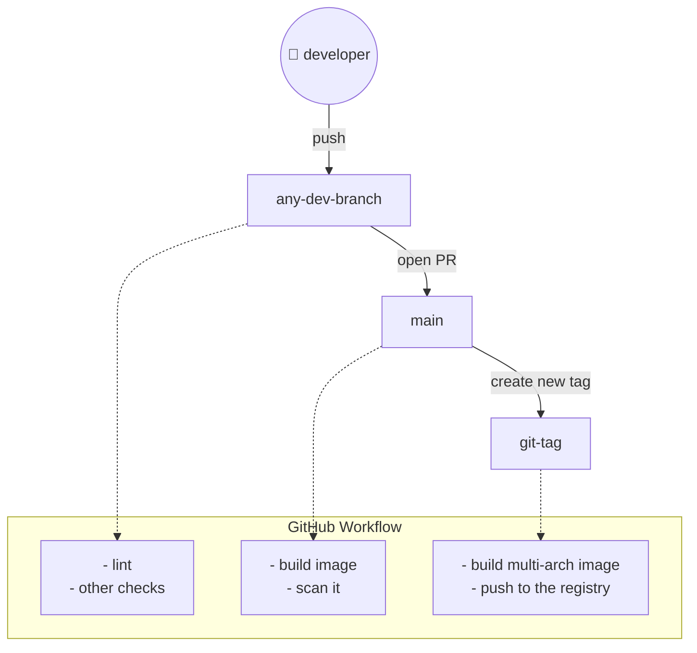

# Dev Container

## Description

Source of the image for development container where most of the tools I use preinstalled.

## CI/CD Workflow

This project uses a **branch-gated CI/CD pipeline** that avoids running heavy jobs where they are not needed. All
workflows are self-contained in this repository under `.github/workflows/`.

### Workflow Triggers

| Trigger                          | Workflow             | What runs                                                                                                                    | Purpose                          |
| -------------------------------- | -------------------- | ---------------------------------------------------------------------------------------------------------------------------- | -------------------------------- |
| Push to any branch except `main` | `docker.lint.yml`    | `hadolint` Dockerfile lint                                                                                                   | Fast feedback during development |
| PR into `main`                   | `docker.pr.yml`      | Build amd64 image, Trivy scan (HIGH/CRITICAL), SARIF upload, smoke test                                                      | Gate — must pass before merge    |
| Push tag `*.*`                   | `docker.release.yml` | Verify tag is on `main`, build multi-arch (`linux/amd64`, `linux/arm64`), push to YC CR, SBOM + SLSA provenance, cosign sign | Release                          |

### Design Goals

- **No heavy jobs on dev branches.** Only lint runs while developers iterate.
- **No duplicate scanning on release.** The image is already scanned during the PR gate. The tag workflow goes straight
  to multi-arch build and push.
- **No external reusable workflows.** All logic is inlined in this repo for full control.
- **Cross-run cache sharing.** PR and release builds share a **registry cache** in YC CR (`cache/devcr`) so layers are
  reused across workflows.

### High-Level Flow

### Security Checks

- **GitGuardian Scan** (`gitguardian.yml`) — runs on every push to `main` and every PR into `main` to detect leaked
  secrets.
- **Trivy Image Scan** — runs during PR gate with severity `HIGH,CRITICAL` and `ignore-unfixed: true`. Findings are
  uploaded to GitHub Code Scanning alerts.
- **Tag Origin Verification** — the release workflow verifies that the pushed tag points to a commit that is an ancestor
  of `main`, preventing releases from arbitrary branches.
- **Image Signing** — every release image is signed with **cosign** using keyless OIDC via GitHub Actions.

### Secrets & Variables

| Name                 | Type     | Source                       | Purpose                                                        |
| -------------------- | -------- | ---------------------------- | -------------------------------------------------------------- |
| `YC_REGISTRY_ID`     | variable | `vars.YC_REGISTRY_ID`        | Yandex Container Registry ID                                   |
| `YC_CR_SA_AUTH_JSON` | secret   | `secrets.YC_CR_SA_AUTH_JSON` | YC service account JSON key for registry login                 |
| `GITHUB_TOKEN`       | secret   | auto-provided                | Authenticated GitHub API requests for `mise` package downloads |

### Cache Strategy

PR and release builds share a **registry cache** stored in YC CR at `cr.yandex/<id>/github/personal/cache/devcr:latest`.

- **PR build** (`docker.pr.yml`) writes cache after scanning.
- **Release build** (`docker.release.yml`) reads the same cache before building multi-arch, significantly reducing
  redundant layer builds.

This avoids the limitations of GHA cache (`type=gha`), where PR caches are isolated to the merge ref and invisible to
release workflows. release integrity.
